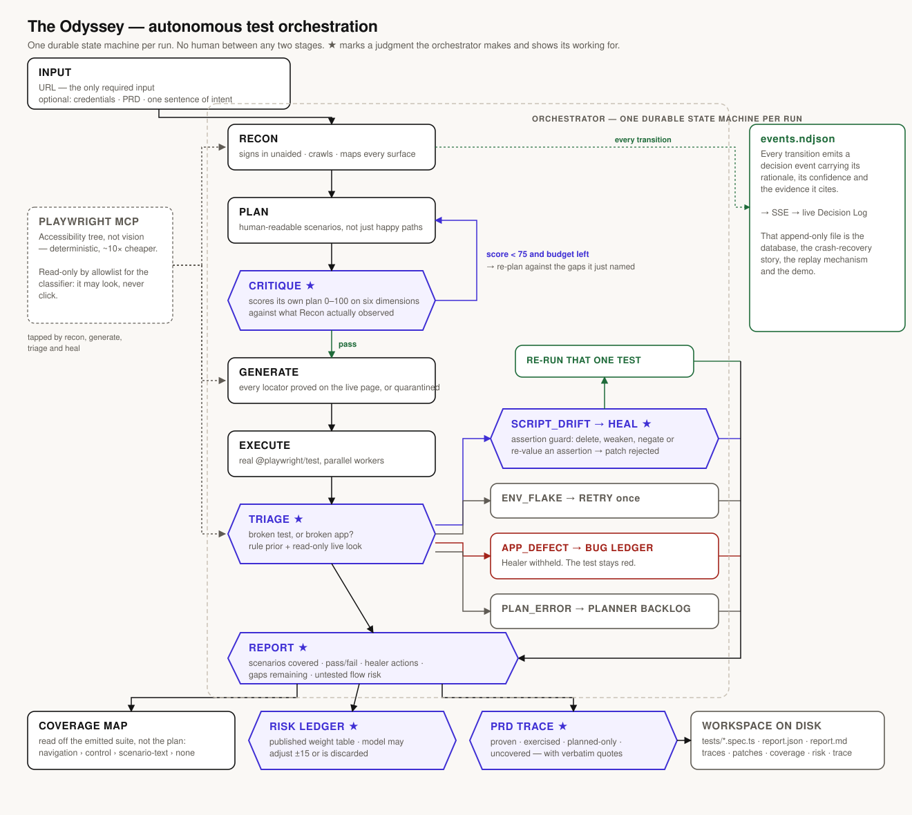
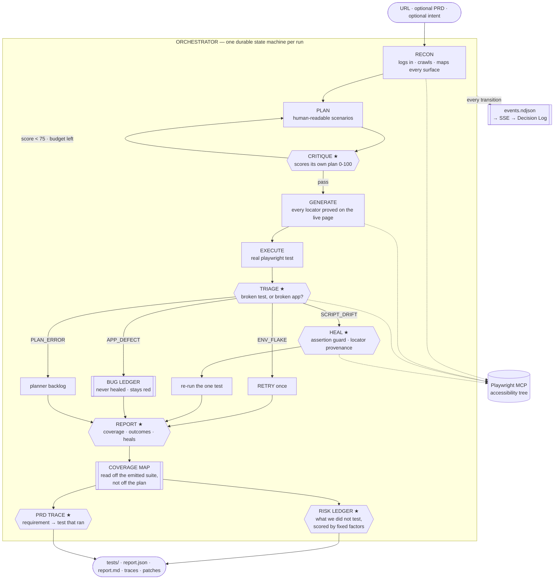

# 🧭 The Odyssey

**An autonomous test orchestration agent.** Give it a URL. It explores the application, writes a
test plan, grades its own plan, generates real Playwright tests whose every selector it proved on
the live page, runs them, works out whether each failure is a broken test or a broken app, repairs
the broken tests, refuses to repair the broken app, and reports what it covered — and what it
did not, and why that is dangerous.

No human between any two of those stages.

> Bessemer Tech Catalyst · AI/ML Track · *Autonomous Test Orchestration Agent*

**Judges start here:** [SUBMISSION.md](SUBMISSION.md) maps every requirement in the brief
to the file that implements it and the artifact that proves it. The architecture diagram
is [`docs/architecture.svg`](docs/architecture.svg); the demo run of show, including what
to do when something goes wrong on stage, is [`docs/DEMO.md`](docs/DEMO.md); the deck is
[`docs/the-odyssey-deck.pptx`](docs/the-odyssey-deck.pptx).

---

## The thesis, in one paragraph

Playwright already ships a Planner, a Generator and a Healer — `npx playwright init-agents`
installs all three today, for free. The problem statement names those three agents word for word,
and then says what is actually missing: *"What they do not do is orchestrate these capabilities end
to end — deciding when to plan, when to generate, when to heal, and when to escalate — without a
human directing each step."* Playwright's own documentation tells you to keep a human approval gate
after planning, after generation, and after healing. **The Odyssey deletes those three humans and
replaces them with machine judgment that shows its working.** The sub-agents are table stakes; the
orchestrator is the product.

---

## Architecture



<details>
<summary>The same diagram as Mermaid, for anywhere that renders it</summary>



</details>

The ★ stages are the ones the brief says nobody builds. They are why this is not a pipeline.

**Every transition emits a `decision` event** carrying its rationale, its confidence and the
evidence it cites. That append-only log *is* the database, the crash-recovery story, the replay
mechanism and the demo, all from one file per run.

### The six ideas that make it more than a pipeline

1. **It grades its own test plan before writing a single test.** Six dimensions, scored against
   what Recon actually observed. Below 75 it rejects its own plan and re-plans against the specific
   gaps it named. On a live clinic app: *62 → seven named gaps → 82, accepted.*
2. **It refuses to write a selector it has not proven.** Not a promise in a prompt — a ledger of
   every locator Playwright itself resolved during the session, checked mechanically against the
   emitted file. A scenario whose elements cannot be found is **quarantined with a reason** rather
   than shipped as a test that will be red forever.
3. **It knows a broken test from a broken app.** A rule-based prior from Playwright's own error
   text plus the generation-time locator ledger, then a *read-only* live look at the application —
   console errors, 5xx responses, is the control still there under a new name. The model may
   overturn the prior; if it does so without citing something it saw live, its confidence is damped
   and the report says why.
4. **The healer is not allowed to cheat.** It may rewrite locators and waits. The assertion set is
   diffed before and after every patch, syntactically: delete an assertion, weaken a matcher, flip
   a negation or change an expected value and **the patch is rejected and the test escalates.**
   Every locator the patch *introduces* must have been proven on the live page, too.
5. **It tells you what it did not test, and it is not guessing.** Which surfaces have no evidence
   is *read off the emitted suite* — a test that visits `/orders` contains that string in a file we
   wrote — and crossed with which tests actually ran. What each uncovered surface is worth is
   computed from fixed, published weights: credentials, money, destructive actions, reachability,
   whether the PRD names it, and whether the plan tried and the Generator quarantined it. The model
   sees the arithmetic and may adjust a score by ±15 — **an adjustment that cites nothing the
   factors missed is discarded, not merely damped.** *"/forgot-password — 78/100, critical. Touches
   credentials. Named in your PRD. One segment from the landing page. The plan covers it and no
   test ever ran."*
6. **A plan that cannot be built is a planning failure, and it re-plans.** The Critic can pass a
   plan at 84/100 that the live application then refuses to yield a single test for — every
   scenario quarantined, nothing emitted. That happened in `run_90f1c9f5`, and every stage after
   it behaved correctly: Execute ran an empty suite, Triage had no failures, and the run published
   a report about nothing. The orchestrator now spends a re-plan on it, handing the Generator's own
   quarantine reasons back to the Planner as directives — the only record of what the application
   actually refused. The rule lives in [`orchestrator/regenerate.ts`](src/server/orchestrator/regenerate.ts),
   away from the state machine's body, so it can be checked without a browser, a model or a key.

---

## Running it

Requires Node 20+ and pnpm. An OpenAI API key is needed for the agents that think; without one
every stage falls back to a deterministic stand-in and the app still runs end to end — including a
genuinely computed coverage map and risk ledger, which need no model.

```bash
pnpm install
pnpm exec playwright install chromium     # the browser the suite runs in
echo 'OPENAI_API_KEY=sk-…'      >> .env.local
echo 'ODYSSEY_REAL_AGENTS=all'  >> .env.local   # omit for the fully-stubbed offline demo
pnpm dev --port 3002
```

Open <http://localhost:3002>, paste a URL, press start. Or drive it from the terminal:

```bash
pnpm demo:reset          # put ShopLite back to a known state between runs
pnpm demo:run            # ShopLite, with the bundled PRD and an intent
pnpm run:tail <runId>    # the event log, one legible line per event
```

Any target, over HTTP:

```bash
curl -sS -X POST localhost:3002/api/runs -H 'content-type: application/json' -d '{
  "url": "https://demo.playwright.dev/todomvc",
  "options": { "maxScenarios": 3, "maxReplans": 1, "budgetUsd": 0.40 }
}'
```

Watch it at `/runs/<id>`, or tail `.odyssey/runs/<id>/events.ndjson`. A run leaves behind a
directory a team could commit as-is:

```
.odyssey/runs/<runId>/
  specs/core.md              the human-readable plan
  tests/*.spec.ts            real Playwright tests
  playwright.config.ts       real config, with the captured session
  heal/patch-*.diff          every accepted patch
  results/                   results.json · traces · videos · screenshots
  selector-provenance.json   which locator was proved, when, for which scenario
  coverage.json              every discovered surface and how it was attributed
  risk.json                  the untested ones, scored, with the factors behind each
  prd-trace.json             requirement → scenario → did a test actually run
  report.json                the machine-readable report
  report.md                  the same report as a document you can put in a PR
  events.ndjson
```

**Inputs.** The URL is the only required one. Optional: credentials, a PRD, and a sentence of
intent (*"focus on checkout and authentication"*). Options: `maxScenarios`, `maxReplans`,
`budgetUsd` (a real ceiling — the stage that spends the money checks it), `parallelWorkers`.

**Credentials do not land in the suite.** A signed-out scenario — rejected credentials, a
protected route bouncing an anonymous visitor — has to type a password, so the Generator is
given one. What it writes into the file is `process.env.ODYSSEY_PASSWORD`, and any literal it
writes anyway is rewritten to that expression before the file exists on disk, with the rewrite
reported as a tool call. The executor supplies the value to the runner; a human re-running the
committed suite supplies it themselves. See [`agents/credentials.ts`](src/server/agents/credentials.ts).

**The browser is visible on purpose.** Watching it log in, hunt for a locator and fail is half of
what makes a run legible. `ODYSSEY_HEADLESS=1` is the server-wide escape hatch for a machine with
no display; no API caller can turn it off per run.

### Models

Every agent's model and reasoning effort is one environment variable, resolved at run time:
`ODYSSEY_MODEL` for all of them, `ODYSSEY_MODEL_RECON` / `_PLANNER` / `_CRITIC` / `_GENERATOR` /
`_CLASSIFIER` / `_HEALER` per agent, and `<any of those>_EFFORT` for the effort dial. Committed
defaults are the cheap tier deliberately; the demo runs a tier up. Per-token prices live beside the
ids in `src/server/agents/models.ts`, because a pinned id with a stale price silently lies to the
budget guard.

### ShopLite — the demo target

Bundled at **<http://localhost:3002/shoplite>** (`ada@shoplite.test` / `lovelace`): a small shop
with sign-in, a basket, checkout and order history. Two switches at `/shoplite/control` break it
on command, which is what makes the classifier demonstrable rather than merely described:

| Switch | What it does | The verdict it should produce |
|---|---|---|
| **Rename "Basket" to "Bag"** | The nav link and the add button both change wording. The app is perfectly healthy. | `SCRIPT_DRIFT` → the Healer re-proves the control and patches the test |
| **Break order history** | `GET /api/shoplite/orders` returns 500. The order still saves. | `APP_DEFECT` → **bug filed, Healer withheld, test stays red** |

ShopLite also carries one bug nobody planted, and the record of it. On `run_6f0284ae` the single
test the pipeline emitted went red, and the classifier called `APP_DEFECT` at 0.72 with cross-test
evidence: `/shoplite/basket` and `/shoplite/orders` were both rendering to a browser carrying no
session while `/shoplite` showed a sign-in form — in violation of ShopLite's own PRD §1.4. It was
right. Those two were client components, `cookies()` is not available to one, and `/shoplite/products`
had the guard all along, which is exactly the "missing or inconsistent" the classifier named. Both
are guarded now, and the comment on the fix names the run that found it.

Flip one *between* two stages of a live run and watch what the orchestrator decides. That is the
demo, and it is the only honest way to test a classifier: generate the suite against a healthy app,
break the app, then run it. In `run_8b37144b` that produced, with no human in between:

```
VERDICT orders-view-authenticated-history -> APP_DEFECT 0.94
  The authenticated Orders page cannot load order history: its dependent API returns
  HTTP 500, and the application logs an ORDER_HISTORY_UNAVAILABLE error caused by an
  exhausted connection pool. The UI renders an explicit failure alert instead of the
  expected order table, confirming an application-side failure rather than a locator
  mismatch.

DECISION Withhold the Healer from 1 of 3 failures
BUG      Authenticated order history fails with exhausted connection pool

VERDICT products-add-item-to-basket -> SCRIPT_DRIFT 0.61
  ...the product controls are labeled "Add to bag", not "Add to basket". This is an
  equivalent control under different wording.
HEAL     -  await page.getByRole("link", { name: "Basket" }).click();
         +  await page.getByRole("link", { name: "Bag" }).click();
         assertionsIntact: true · 1 new locator, resolved live · re-run green

DECISION Reject the Healer's patch for signin-invalid-credentials — it weakened an assertion
```

The last line was not staged. The Healer's own summary of that patch said *"without changing any
assertions"*; the syntactic diff disagreed, and the diff wins.

---

## The final report

The brief's last Must Have names five things: *scenarios covered, pass/fail outcomes, healer
actions taken, coverage gaps remaining, and untested flow risk.* All five are on
`/runs/<id>/report`, and all five are also written to `report.md` in the run's workspace — the
same report as a document you can open a pull request with.

Two of those five are easy to fake, so both are built the same way the defect classifier is: a
deterministic layer that reproduces exactly, and a model that may only add what the rules could
not see.

### Untested flow risk

Coverage is **measured, not asserted**. A route counts as exercised when a test that actually ran
navigates to it — the path appears as a quoted string in a `.spec.ts` file this run wrote — and
the report prints which signal made each attribution, so a weaker one is visible as a weaker one:

| Signal | What it means |
|---|---|
| `navigation` | The emitted code contains the path. The strongest claim available. |
| `control` | The emitted code drives a control named after the route. It got there by clicking. |
| `scenario-text` | Only the *plan* names the route. Reported as the plan's word, not the suite's. |
| `none` | Nothing reached it. |

That yields three states, and the middle one is the point: **`planned-only` — the plan covers this
surface and no test ever ran.** Intent without evidence, which is worse news than a surface nobody
thought of, and it is scored accordingly.

Each uncovered surface is then scored by a published weight table (`agents/risk-signals.ts`), so
the ranking is arithmetic anyone can check:

| Factor | Weight |
|---|---|
| Touches credentials, sessions or account recovery | 22 |
| Handles money or personal data | 20 |
| Exposes a destructive or privileged action | 18 |
| Named in the supplied PRD | 18 |
| The plan covered it and no test ran | 18 |
| Reachable in ≤2 path segments from the landing page | 12 |
| Named in a coverage gap the critic never closed | 10 |
| Behind the session Recon signed in with | 8 |

The thresholds are calibrated against the product's own worked example: credentials + reachable +
named in the PRD = 52, which must come out **high**. A unit test pins that, so a quiet edit to a
weight cannot silently re-rank every report the system will ever produce.

The model sees all of this and may adjust a score by at most ±15, or add a risk that has no URL —
a confirmation modal, a cross-origin payment iframe, an outbound email step. Both powers are
gated: **an adjustment whose justification names nothing is discarded and the arithmetic stands**,
and an added surface must cite a Recon observation *by index*, checked against the array. The
report prints the computed score beside any adjusted one.

Because none of the scoring layer needs a model, **the risk ledger is real even with no API key**.

### PRD-to-test-plan gap analysis

The brief's first Bonus item. A model maps requirements to scenarios; two mechanical checks then
decide what that mapping is worth.

**An invented scenario id is struck out and counted.** A citation naming a scenario the plan does
not contain is a false claim, not a weak one, and it lands on exactly the requirement most likely
to be uncovered. The count is reported — an extraction that invented three references tells you
how much to trust the other forty.

**A plan is not evidence.** Coverage is resolved through what the run actually did, into four
states rather than a tick:

| Status | Meaning |
|---|---|
| `proven` | A test covering it ran and passed. |
| `exercised` | A test covering it ran and is red. There is evidence, and it is bad news. |
| `planned-only` | The plan covers it. No test that ran reached it. **Not covered.** |
| `uncovered` | Nothing in the plan addresses it. |

That third row is the whole value of the table. The naive version of this feature ticks a
requirement whose only scenario the Generator quarantined, and tells a team their PRD is covered
about a flow nothing ever loaded.

**A quote the document does not contain is dropped and counted.** Every requirement carries a
verbatim quote so a reader can check the extraction in seconds — and that was a promise until
`run_6f0284ae`, where all nineteen quotes were faithful and *none* of them would have grepped,
because the PRD wraps its lines and the model joined them with spaces. The check is the system's
now, not the reader's: quotes are verified against text normalised for whitespace and for the
typographic quotes and dashes a model reflows ASCII into — the document's formatting, not the
model's claim — and anything that fails is struck, like an invented scenario id. A citation a
reader cannot check is worse than none, because one wrong row costs a reader the other eighteen.

---

## What is real, and what is not

This repo distinguishes "the code exists" from "a real run produced it", and says which is which.

| Stage | Status |
|---|---|
| Recon, Planner, Coverage Critic | ✅ real, **verified by live runs** — signed in unaided, crawled 11 authenticated routes, scored 62 → replanned → 82 |
| Generator, Executor | ✅ real, **verified by a green live run** — 2 tests at 14/14 and 20/20 proven locators, `expected: 2, unexpected: 0`, $0.317 |
| Classifier, Healer, rerun, ShopLite | ✅ real, **verified by a live run** — `run_8b37144b` classified a 500 as `APP_DEFECT` at 0.94 and left it red, healed a renamed control, and had a patch rejected by the assertion guard. $0.161 |
| Coverage map, risk scoring | ✅ real and **pinned by 41 unit assertions** — arithmetic with a published weight table, no model involved, so it produces a true ledger even with no API key |
| Risk review pass, PRD traceability | ✅ real, **verified by a live run** — `run_6f0284ae` published a ranked risk ledger led by *"Place order checkout submission, 95/100"* and traced 19 PRD requirements with 0 invented citations. Its quotes were all faithful and none of them would have grepped, which is what the quote gate below now catches |
| Re-plan on an unbuildable plan, credential hand-off, quote verification | ✅ real, **pinned by unit assertions**, and every one of them exists because a live run found the defect it fixes |

**The console's fleet-level pages — Overview, Coverage, Defects, Schedule, Targets — describe the
product around a single run and are driven by seeded data.** Every one of them says so on the page,
in a banner, rather than presenting the numbers or hiding the pages from the navigation. Everything
under *Past runs*, and everything inside any run you open, is measured by that run.

The open design question, stated rather than hidden: the storage-state hand-off carries the
agents' own side effects into the generated suite — if Recon creates a record while crawling, the
suite starts with it present. ShopLite shows what an application immune to this looks like (its
basket lives in `sessionStorage`, which `storageState` does not carry); it does not solve the
general case.

Full engineering detail — every decision, every defect a live run exposed, and what each cost —
is in [`docs/IMPLEMENTATION_PLAN.md`](docs/IMPLEMENTATION_PLAN.md). The strategy is in
[`PLAN.md`](PLAN.md).

---

## Stack

React 19 · TypeScript · Tailwind v4 · Next.js 16 (App Router) · `@openai/agents` ·
`@playwright/mcp` (accessibility tree, not vision — deterministic and ~10× cheaper) ·
real `@playwright/test` in a per-run workspace · append-only event log on disk.

No database. One user, one run at a time, and every artifact is a file that Playwright's own
tooling expects on disk. Hackathon wifi is hostile; every network dependency is a way to fail
live in front of judges.

## Tests

```bash
pnpm verify      # typecheck · lint · 123 assertions, ~2s, no API and no browser
```

They cover the parts where a silent regression would be invisible and expensive — which in this
repo means the parts that fail by producing a plausible-looking table rather than an error:

- **the locator provenance gate**, and the classifier's rule-based prior
- **the Playwright-report-to-generated-test match**, which once turned a fully green suite into a
  fully red report
- **the scenario-to-result join**, which once rendered every row of a fully executed suite as
  `pending` because the report looked results up under an id only the fixtures ever used
- **the risk weight table and its thresholds**, calibrated against the product's own worked
  example so a quiet edit cannot re-rank every report
- **the PRD gate** — that an invented scenario id is struck out, and that a requirement whose only
  scenario was quarantined comes back `planned-only` rather than covered
- **the Markdown report**, for every sentence it must not say: no tick on a requirement with no
  test, no implication that red tests were understood when nothing classified them, and no reading
  as a pass when nothing executed
- **the re-plan gate**, so an unbuildable plan is re-planned exactly while there is allowance for
  it, and escalates rather than looping when there is not
- **the credential rewrite**, including that a password buried in a longer string literal is
  flagged rather than spliced into a syntax error
