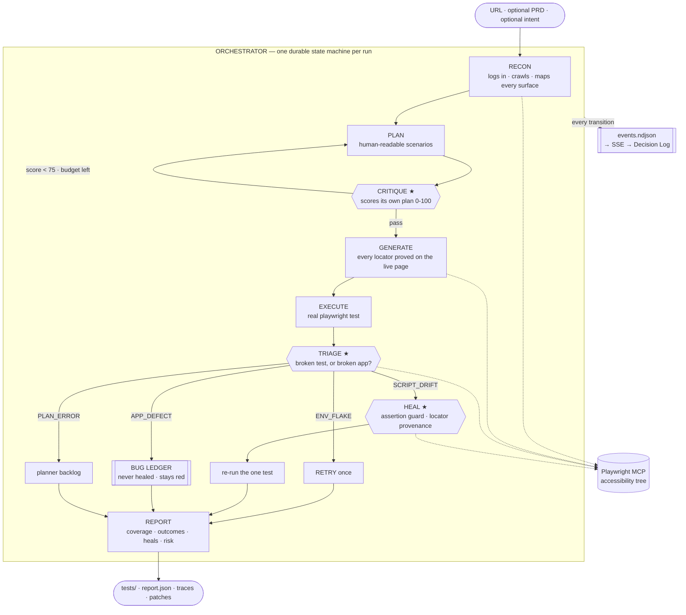

# 🧭 The Odyssey

**An autonomous test orchestration agent.** Give it a URL. It explores the application, writes a
test plan, grades its own plan, generates real Playwright tests whose every selector it proved on
the live page, runs them, works out whether each failure is a broken test or a broken app, repairs
the broken tests, refuses to repair the broken app, and reports what it covered — and what it
did not, and why that is dangerous.

No human between any two of those stages.

> Bessemer Tech Catalyst · AI/ML Track · *Autonomous Test Orchestration Agent*

---

## The thesis, in one paragraph

Playwright already ships a Planner, a Generator and a Healer — `npx playwright init-agents`
installs all three today, for free. The problem statement names those three agents word for word,
and then says what is actually missing: *"What they do not do is orchestrate these capabilities end
to end — deciding when to plan, when to generate, when to heal, and when to escalate — without a
human directing each step."* Playwright's own documentation tells you to keep a human approval gate
after planning, after generation, and after healing. **The Odyssey deletes those three humans and
replaces them with machine judgment that shows its working.** The sub-agents are table stakes; the
orchestrator is the product.

---

## Architecture



The ★ stages are the ones the brief says nobody builds. They are why this is not a pipeline.

**Every transition emits a `decision` event** carrying its rationale, its confidence and the
evidence it cites. That append-only log *is* the database, the crash-recovery story, the replay
mechanism and the demo, all from one file per run.

### The five ideas that make it more than a pipeline

1. **It grades its own test plan before writing a single test.** Six dimensions, scored against
   what Recon actually observed. Below 75 it rejects its own plan and re-plans against the specific
   gaps it named. On a live clinic app: *62 → seven named gaps → 82, accepted.*
2. **It refuses to write a selector it has not proven.** Not a promise in a prompt — a ledger of
   every locator Playwright itself resolved during the session, checked mechanically against the
   emitted file. A scenario whose elements cannot be found is **quarantined with a reason** rather
   than shipped as a test that will be red forever.
3. **It knows a broken test from a broken app.** A rule-based prior from Playwright's own error
   text plus the generation-time locator ledger, then a *read-only* live look at the application —
   console errors, 5xx responses, is the control still there under a new name. The model may
   overturn the prior; if it does so without citing something it saw live, its confidence is damped
   and the report says why.
4. **The healer is not allowed to cheat.** It may rewrite locators and waits. The assertion set is
   diffed before and after every patch, syntactically: delete an assertion, weaken a matcher, flip
   a negation or change an expected value and **the patch is rejected and the test escalates.**
   Every locator the patch *introduces* must have been proven on the live page, too.
5. **It tells you what it did not test.** Every surface Recon found and the plan never covered,
   scored for risk. *"Password reset — HIGH RISK, untested. Reachable from the login page, touches
   credentials, named in section 4 of your PRD."*

---

## Running it

Requires Node 20+, pnpm, and an OpenAI API key.

```bash
pnpm install
pnpm exec playwright install chromium     # the browser the suite runs in
echo 'OPENAI_API_KEY=sk-…'      >> .env.local
echo 'ODYSSEY_REAL_AGENTS=all'  >> .env.local   # omit for the fully-stubbed offline demo
pnpm dev --port 3002
```

Open <http://localhost:3002>, paste a URL, press start. Or drive it over HTTP:

```bash
curl -sS -X POST localhost:3002/api/runs -H 'content-type: application/json' -d '{
  "url": "https://demo.playwright.dev/todomvc",
  "options": { "maxScenarios": 3, "maxReplans": 1, "budgetUsd": 0.40 }
}'
```

Watch it at `/runs/<id>`, or tail `.odyssey/runs/<id>/events.ndjson`. A run leaves behind a
directory a team could commit as-is:

```
.odyssey/runs/<runId>/
  specs/core.md              the human-readable plan
  tests/*.spec.ts            real Playwright tests
  playwright.config.ts       real config, with the captured session
  heal/patch-*.diff          every accepted patch
  results/                   results.json · traces · videos · screenshots
  selector-provenance.json   which locator was proved, when, for which scenario
  report.json · events.ndjson
```

**Inputs.** The URL is the only required one. Optional: credentials, a PRD, and a sentence of
intent (*"focus on checkout and authentication"*). Options: `maxScenarios`, `maxReplans`,
`budgetUsd` (a real ceiling — the stage that spends the money checks it), `parallelWorkers`.

**The browser is visible on purpose.** Watching it log in, hunt for a locator and fail is half of
what makes a run legible. `ODYSSEY_HEADLESS=1` is the server-wide escape hatch for a machine with
no display; no API caller can turn it off per run.

### Models

Every agent's model and reasoning effort is one environment variable, resolved at run time:
`ODYSSEY_MODEL` for all of them, `ODYSSEY_MODEL_RECON` / `_PLANNER` / `_CRITIC` / `_GENERATOR` /
`_CLASSIFIER` / `_HEALER` per agent, and `<any of those>_EFFORT` for the effort dial. Committed
defaults are the cheap tier deliberately; the demo runs a tier up. Per-token prices live beside the
ids in `src/server/agents/models.ts`, because a pinned id with a stale price silently lies to the
budget guard.

### ShopLite — the demo target

Bundled at **<http://localhost:3002/shoplite>** (`ada@shoplite.test` / `lovelace`): a small shop
with sign-in, a basket, checkout and order history. Two switches at `/shoplite/control` break it
on command, which is what makes the classifier demonstrable rather than merely described:

| Switch | What it does | The verdict it should produce |
|---|---|---|
| **Rename the add button** | "Add to cart" → "Add to bag". The app is perfectly healthy. | `SCRIPT_DRIFT` → the Healer re-proves the control and patches the test |
| **Break order history** | `GET /api/shoplite/orders` returns 500. The order still saves. | `APP_DEFECT` → **bug filed, Healer withheld, test stays red** |

Flip one *between* two stages of a live run and watch what the orchestrator decides.

---

## What is real, and what is not

This repo distinguishes "the code exists" from "a real run produced it", and says which is which.

| Stage | Status |
|---|---|
| Recon, Planner, Coverage Critic | ✅ real, **verified by live runs** — signed in unaided, crawled 11 authenticated routes, scored 62 → replanned → 82 |
| Generator, Executor | ✅ real, **verified by a green live run** — 2 tests at 14/14 and 20/20 proven locators, `expected: 2, unexpected: 0`, $0.317 |
| Classifier, Healer, rerun, ShopLite | ⚠️ **built and unit-tested; no orchestrated run has been through them yet** |
| Risk ledger, PRD trace | deterministic stand-ins (Phase 6) |

The open design question, stated rather than hidden: the storage-state hand-off carries the
agents' own side effects into the generated suite — if Recon creates a record while crawling, the
suite starts with it present. ShopLite shows what an application immune to this looks like (its
basket lives in `sessionStorage`, which `storageState` does not carry); it does not solve the
general case.

Full engineering detail — every decision, every defect a live run exposed, and what each cost —
is in [`docs/IMPLEMENTATION_PLAN.md`](docs/IMPLEMENTATION_PLAN.md). The strategy is in
[`PLAN.md`](PLAN.md).

---

## Stack

React 19 · TypeScript · Tailwind v4 · Next.js 16 (App Router) · `@openai/agents` ·
`@playwright/mcp` (accessibility tree, not vision — deterministic and ~10× cheaper) ·
real `@playwright/test` in a per-run workspace · append-only event log on disk.

No database. One user, one run at a time, and every artifact is a file that Playwright's own
tooling expects on disk. Hackathon wifi is hostile; every network dependency is a way to fail
live in front of judges.

## Tests

```bash
pnpm test        # 40 assertions, ~0.5s, no API and no browser
pnpm typecheck
pnpm lint
```

They cover the parts where a silent regression would be invisible and expensive: the locator
provenance gate, the report-to-test match that once turned a fully green suite into a fully red
report, the classifier's prior, and the heal diff.
